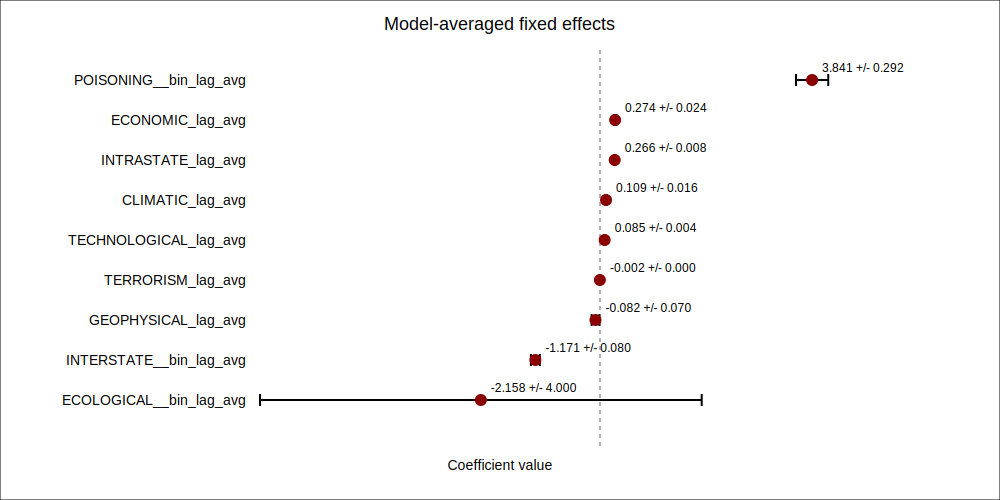
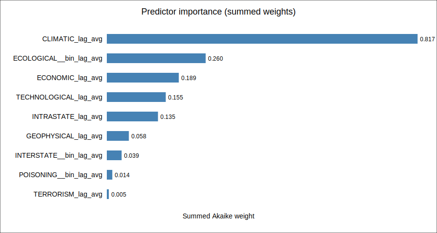
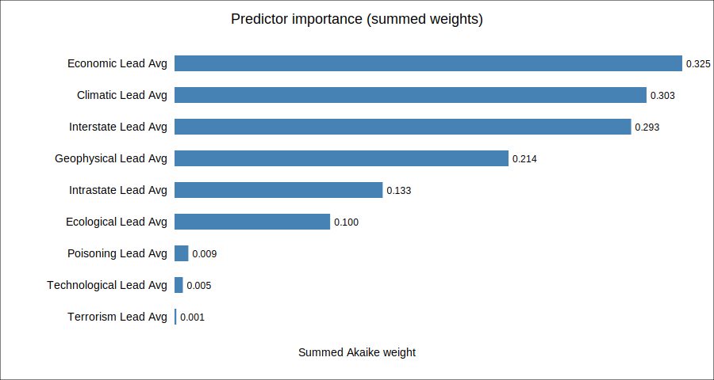
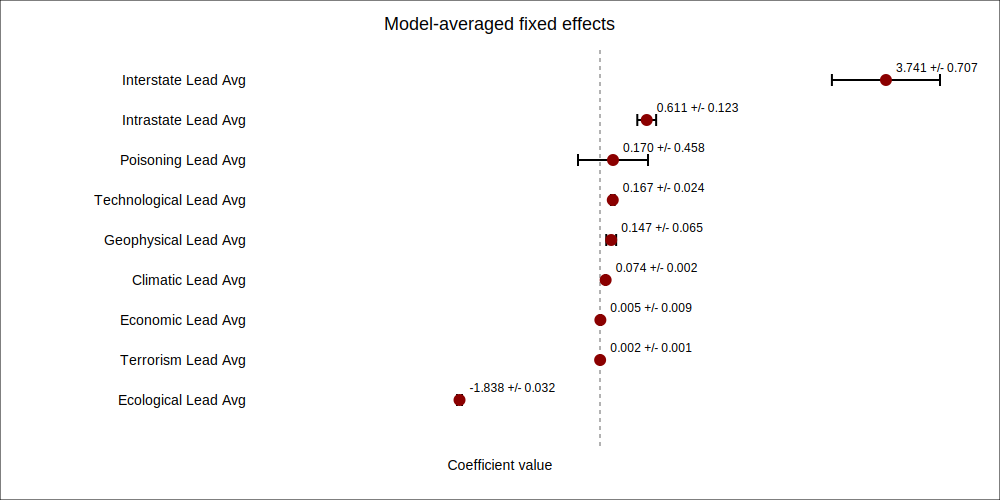
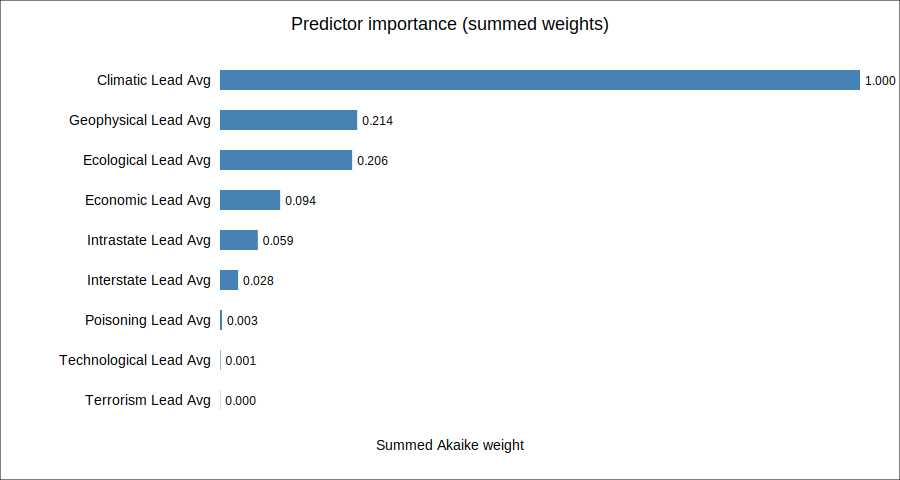
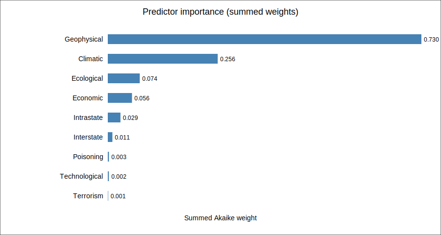
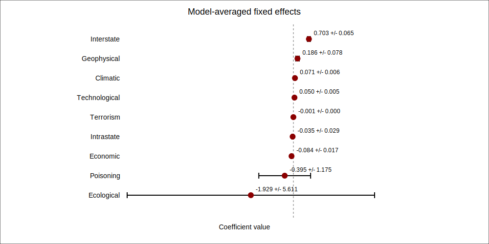

# Regression Scope Report

This report starts with descriptive insights from the full panel (1990-2013, 3,221 country-year observations across 145 countries) before summarising the model-averaged regressions.
Intercepts, outbreak controls, and `scale(year)` terms were already excluded from the regression visualisations; here we additionally avoid reporting both count and binary versions of the same covariate.

## Descriptive overview

- Total outbreak events recorded: 877 (4,704,085 cases, 174,020 deaths).
- Geographic coverage: 5 continents, 145 countries.

### Outbreak intensity by continent

| Continent | Observations | Outbreaks | Outbreak rate | Mean cases | Mean deaths |
|---|---:|---:|---:|---:|---:|
| Africa | 1,085 | 381 | 35.1% | 2680.13 | 121.54 |
| America | 554 | 147 | 26.5% | 1092.18 | 31.46 |
| Asia | 765 | 201 | 26.3% | 1208.51 | 31.71 |
| Europe | 730 | 139 | 19.0% | 365.16 | 0.64 |
| Oceania | 87 | 9 | 10.3% | 0.02 | 0.02 |

### Count vs. binary decision

We inspected each hazard/exposure covariate that had both a count and binary version in the raw panel. If at least 10% of the non-zero observations exceeded one event, we kept the count series; otherwise we reported the binary indicator.

| Variable | Encoding | Non-zero obs | Share >1 | Rationale |
|---|---|---:|---:|---|
| ECOLOGICAL | binary | 141 | 4.3% | Only 4.3% of non-zero observations exceed one event; a binary indicator captures presence without adding noise. |
| GEOPHYSICAL | count | 425 | 37.4% | 37.4% of non-zero observations exceed one event (>= 10.0% threshold), so the count series conveys intensity. |
| INTERSTATE | binary | 75 | 0.0% | Only 0.0% of non-zero observations exceed one event; a binary indicator captures presence without adding noise. |
| POISONING | binary | 44 | 9.1% | Only 9.1% of non-zero observations exceed one event; a binary indicator captures presence without adding noise. |

All subsequent regression summaries only reference the chosen encoding for each family (for example, we report `INTERSTATE__bin` rather than `INTERSTATE` because interstate disputes rarely exceed a single episode in a year).

## Lags

### Lags - Africa
- Best-scoring specification `575c97858cb7dbc1d0d9fcb9c2d8da7a` for DV `Outbreak` with Akaike weight 0.011.
- Top weighted coefficients: POISONING__bin_lag_avg (+3.841), ECOLOGICAL__bin_lag_avg (-2.158), INTERSTATE__bin_lag_avg (-1.171), ECONOMIC_lag_avg (+0.274), INTRASTATE_lag_avg (+0.266).
- Top-model weights figure: `outputs/lags/africa/top_model_weights.svg`

### Lags - America
- Best-scoring specification `aa26c1825a2f4252041a484f034d996f` for DV `Outbreak` with Akaike weight 0.023.
- Top weighted coefficients: INTRASTATE_lag_avg (+0.619), INTERSTATE__bin_lag_avg (+0.485), POISONING__bin_lag_avg (+0.297), TECHNOLOGICAL_lag_avg (+0.193), ECOLOGICAL__bin_lag_avg (-0.179).
- Top-model weights figure: `outputs/lags/america/top_model_weights.svg`

### Lags - Asia
- Best-scoring specification `e68b3396bc2eed5218ce4a90d5e362ae` for DV `Outbreak` with Akaike weight 0.002.
- Top weighted coefficients: ECOLOGICAL__bin_lag_avg (+1.290), POISONING__bin_lag_avg (-0.772), GEOPHYSICAL_lag_avg (+0.199), INTRASTATE_lag_avg (-0.182), CLIMATIC_lag_avg (+0.130).
- Top-model weights figure: `outputs/lags/asia/top_model_weights.svg`

### Lags - Europe
- Best-scoring specification `f5bbc7ae8cfc5d454d0535168716d596` for DV `Outbreak` with Akaike weight 0.004.
- Top weighted coefficients: POISONING__bin_lag_avg (+3.060), INTERSTATE__bin_lag_avg (-0.965), ECONOMIC_lag_avg (-0.662), ECOLOGICAL__bin_lag_avg (+0.588), CLIMATIC_lag_avg (+0.311).
- Top-model weights figure: `outputs/lags/europe/top_model_weights.svg`

### Lags - Global
- Best-scoring specification `292a265bd3ea3a266c722ef5ab6eab2d` for DV `Outbreak` with Akaike weight 0.069.
- Top weighted coefficients: POISONING__bin_lag_avg (+1.156), INTERSTATE__bin_lag_avg (-0.862), ECOLOGICAL__bin_lag_avg (+0.468), ECONOMIC_lag_avg (+0.213), GEOPHYSICAL_lag_avg (+0.117).
- Top-model weights figure: `outputs/lags/global/top_model_weights.svg`

## Leads

### Leads - Africa
- Best-scoring specification `2c77a0ddea4b1194d52d43807a383b63` for DV `Outbreak` with Akaike weight 0.003.
- Top weighted coefficients: GEOPHYSICAL_lead_avg (-6.538), INTERSTATE__bin_lead_avg (-3.922), POISONING__bin_lead_avg (+2.055), INTRASTATE_lead_avg (+0.387), ECONOMIC_lead_avg (+0.336).
- Top-model weights figure: `outputs/leads/africa/top_model_weights.svg`

### Leads - America
- Best-scoring specification `c7e02fcb661a02f31045b42817bb7b45` for DV `Outbreak` with Akaike weight 0.001.
- Top weighted coefficients: INTERSTATE__bin_lead_avg (+3.741), ECOLOGICAL__bin_lead_avg (-1.838), INTRASTATE_lead_avg (+0.611), POISONING__bin_lead_avg (+0.170), TECHNOLOGICAL_lead_avg (+0.167).
- Top-model weights figure: `outputs/leads/america/top_model_weights.svg`

### Leads - Asia
- Best-scoring specification `0344219b11aa0acee6777448dcca433e` for DV `Outbreak` with Akaike weight 0.001.
- Top weighted coefficients: ECOLOGICAL__bin_lead_avg (-1.250), INTERSTATE__bin_lead_avg (+0.499), POISONING__bin_lead_avg (-0.119), CLIMATIC_lead_avg (+0.113), ECONOMIC_lead_avg (+0.057).
- Top-model weights figure: `outputs/leads/asia/top_model_weights.svg`

### Leads - Europe
- Best-scoring specification `419a6ef61de71855f0d43807979de480` for DV `Outbreak` with Akaike weight 0.004.
- Top weighted coefficients: INTERSTATE__bin_lead_avg (+2.105), GEOPHYSICAL_lead_avg (-1.184), INTRASTATE_lead_avg (+0.716), POISONING__bin_lead_avg (+0.684), ECOLOGICAL__bin_lead_avg (-0.503).
- Top-model weights figure: `outputs/leads/europe/top_model_weights.svg`

### Leads - Global
- Best-scoring specification `706e5078762adb2d9d9f24b4f660df95` for DV `Outbreak` with Akaike weight 0.005.
- Top weighted coefficients: ECOLOGICAL__bin_lead_avg (-0.859), POISONING__bin_lead_avg (+0.462), ECONOMIC_lead_avg (+0.292), INTRASTATE_lead_avg (+0.191), CLIMATIC_lead_avg (+0.117).
- Top-model weights figure: `outputs/leads/global/top_model_weights.svg`

## Contemporaneous

### Contemporaneous - Africa
- Best-scoring specification `1b6c11f6f89cd7c5b8a1dc11dfbc57a4` for DV `Outbreak` with Akaike weight 0.007.
- Top weighted coefficients: GEOPHYSICAL (+18.600), POISONING__bin (+1.140), INTRASTATE (+0.287), INTERSTATE__bin (+0.208), CLIMATIC (+0.131).
- Top-model weights figure: `outputs/contemp/africa/top_model_weights.svg`

### Contemporaneous - Asia
- Best-scoring specification `a6ffe30149253560f0ca1c48c8684a85` for DV `Outbreak` with Akaike weight 0.003.
- Top weighted coefficients: ECOLOGICAL__bin (-1.929), INTERSTATE__bin (+0.703), POISONING__bin (-0.395), GEOPHYSICAL (+0.186), ECONOMIC (-0.084).
- Top-model weights figure: `outputs/contemp/asia/top_model_weights.svg`

### Contemporaneous - Europe
- Best-scoring specification `73da7f537814038ead10c648508d64e5` for DV `Outbreak` with Akaike weight 0.002.
- Top weighted coefficients: POISONING__bin (+0.929), INTERSTATE__bin (+0.535), ECOLOGICAL__bin (+0.320), CLIMATIC (+0.136), TECHNOLOGICAL (+0.134).
- Top-model weights figure: `outputs/contemp/europe/top_model_weights.svg`

### Contemporaneous - Global
- Best-scoring specification `2de5b3dc48d10aa9af6031599a53c60b` for DV `Outbreak` with Akaike weight 0.043.
- Top weighted coefficients: INTERSTATE__bin (+0.463), ECOLOGICAL__bin (-0.217), INTRASTATE (+0.163), GEOPHYSICAL (+0.114), ECONOMIC (+0.097).
- Top-model weights figure: `outputs/contemp/global/top_model_weights.svg`

