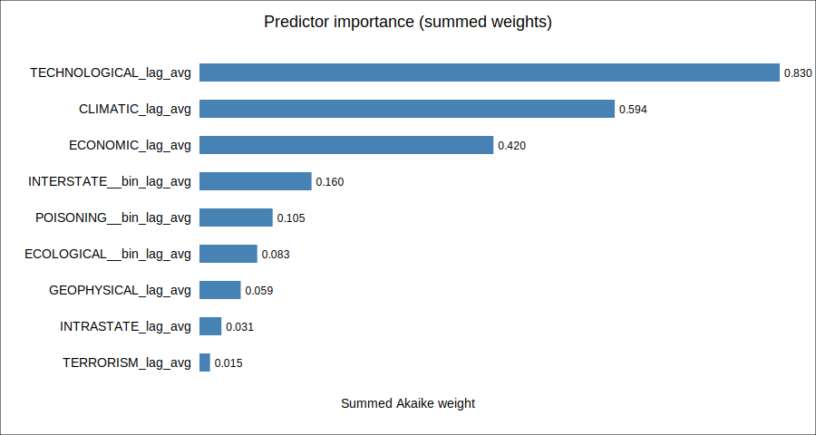
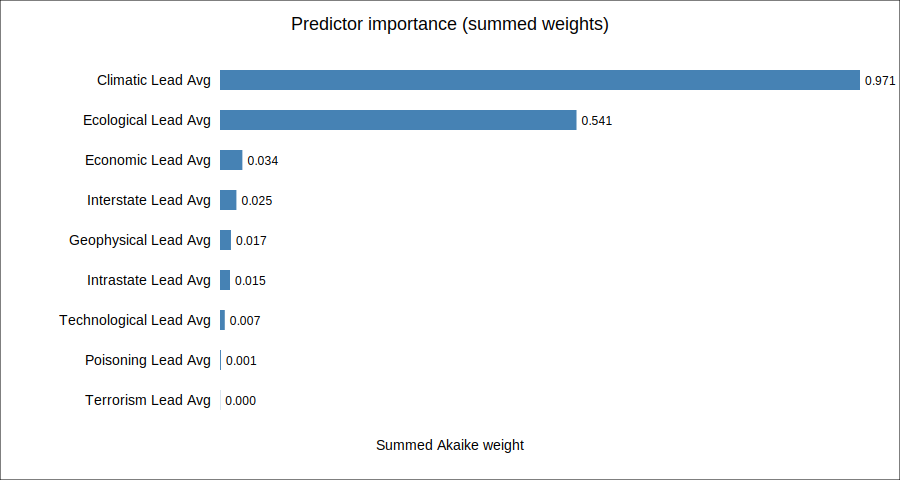
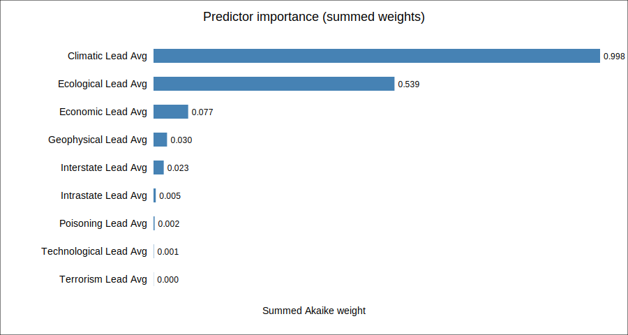
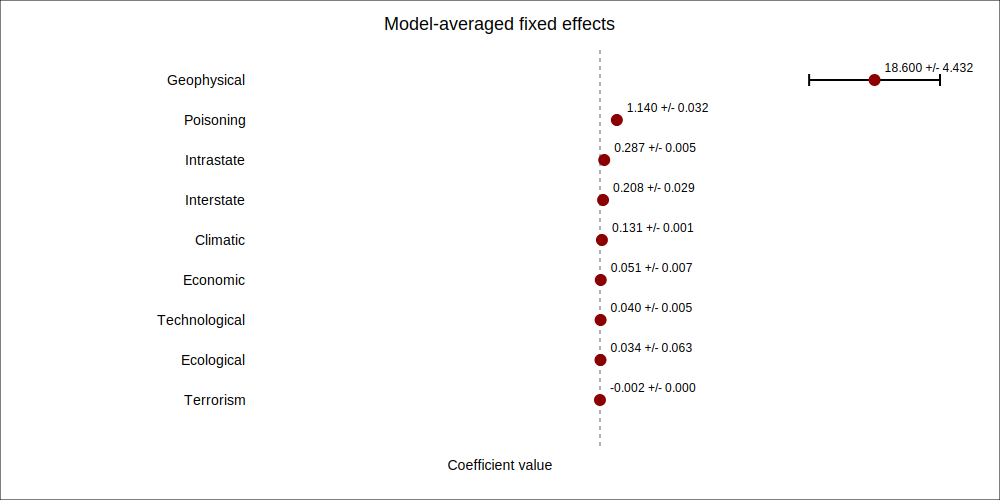
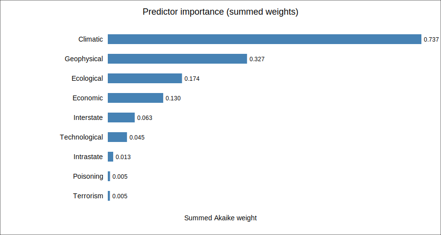
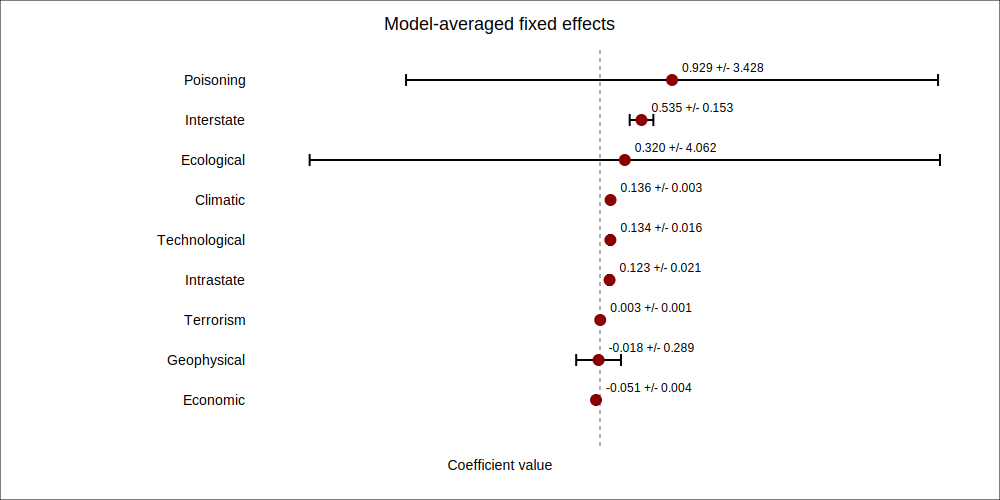
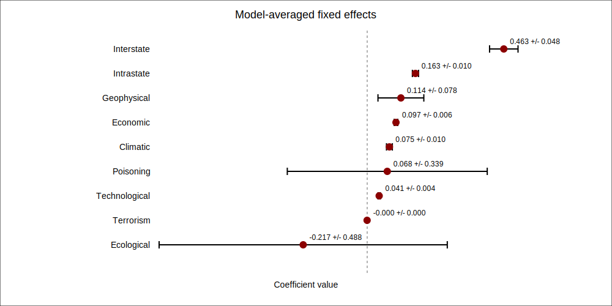

# Regression Scope Report

This report summarizes the per-scope model averaging outputs for the lag, lead, and contemporaneous datasets.
Intercepts, outbreak indicators, and scale(year) terms were removed from coefficient visualisations and importance scores.
All analyses rely on the shared analysis/model_analysis.py utilities and write scope-specific results to outputs/<dataset>/<scope>/.

## Lags

### Lags - Africa
- Best-scoring specification 575c97858cb7dbc1d0d9fcb9c2d8da7a for DV Outbreak with Akaike weight 0.011.
- Top weighted coefficients: POISONING_lag_avg (+3.842), POISONING__bin_lag_avg (+3.841), ECOLOGICAL_lag_avg (+3.336), ECOLOGICAL__bin_lag_avg (-2.158), INTERSTATE_lag_avg (-1.171).
- Top-model weights figure: outputs/lags/africa/top_model_weights.svg

### Lags - America
- Best-scoring specification aa26c1825a2f4252041a484f034d996f for DV Outbreak with Akaike weight 0.023.
- Top weighted coefficients: POISONING_lag_avg (+1.037), INTRASTATE_lag_avg (+0.619), INTERSTATE_lag_avg (+0.547), INTERSTATE__bin_lag_avg (+0.485), POISONING__bin_lag_avg (+0.297).
- Top-model weights figure: outputs/lags/america/top_model_weights.svg

### Lags - Asia
- Best-scoring specification e68b3396bc2eed5218ce4a90d5e362ae for DV Outbreak with Akaike weight 0.002.
- Top weighted coefficients: ECOLOGICAL_lag_avg (+1.360), ECOLOGICAL__bin_lag_avg (+1.290), POISONING__bin_lag_avg (-0.772), GEOPHYSICAL_lag_avg (+0.199), INTRASTATE_lag_avg (-0.182).
- Top-model weights figure: outputs/lags/asia/top_model_weights.svg

### Lags - Europe
- Best-scoring specification f5bbc7ae8cfc5d454d0535168716d596 for DV Outbreak with Akaike weight 0.004.
- Top weighted coefficients: POISONING__bin_lag_avg (+3.060), POISONING_lag_avg (+3.041), INTERSTATE__bin_lag_avg (-0.965), INTERSTATE_lag_avg (-0.964), ECONOMIC_lag_avg (-0.662).
- Top-model weights figure: outputs/lags/europe/top_model_weights.svg

### Lags - Global
- Best-scoring specification 292a265bd3ea3a266c722ef5ab6eab2d for DV Outbreak with Akaike weight 0.069.
- Top weighted coefficients: POISONING_lag_avg (+1.654), POISONING__bin_lag_avg (+1.156), INTERSTATE_lag_avg (-0.880), INTERSTATE__bin_lag_avg (-0.862), ECOLOGICAL__bin_lag_avg (+0.468).
- Top-model weights figure: outputs/lags/global/top_model_weights.svg

## Leads

### Leads - Africa
- Best-scoring specification 2c77a0ddea4b1194d52d43807a383b63 for DV Outbreak with Akaike weight 0.003.
- Top weighted coefficients: GEOPHYSICAL_lead_avg (-6.538), GEOPHYSICAL__bin_lead_avg (+5.936), INTERSTATE_lead_avg (-3.961), INTERSTATE__bin_lead_avg (-3.922), POISONING_lead_avg (+2.057).
- Top-model weights figure: outputs/leads/africa/top_model_weights.svg

### Leads - America
- Best-scoring specification c7e02fcb661a02f31045b42817bb7b45 for DV Outbreak with Akaike weight 0.001.
- Top weighted coefficients: INTERSTATE__bin_lead_avg (+3.741), INTERSTATE_lead_avg (+3.740), ECOLOGICAL__bin_lead_avg (-1.838), ECOLOGICAL_lead_avg (-1.697), INTRASTATE_lead_avg (+0.611).
- Top-model weights figure: outputs/leads/america/top_model_weights.svg

### Leads - Asia
- Best-scoring specification 0344219b11aa0acee6777448dcca433e for DV Outbreak with Akaike weight 0.001.
- Top weighted coefficients: ECOLOGICAL__bin_lead_avg (-1.250), ECOLOGICAL_lead_avg (-0.984), INTERSTATE__bin_lead_avg (+0.499), INTERSTATE_lead_avg (+0.499), GEOPHYSICAL__bin_lead_avg (-0.184).
- Top-model weights figure: outputs/leads/asia/top_model_weights.svg

### Leads - Europe
- Best-scoring specification 419a6ef61de71855f0d43807979de480 for DV Outbreak with Akaike weight 0.004.
- Top weighted coefficients: INTERSTATE__bin_lead_avg (+2.105), INTERSTATE_lead_avg (+2.105), GEOPHYSICAL__bin_lead_avg (-1.220), GEOPHYSICAL_lead_avg (-1.184), INTRASTATE_lead_avg (+0.716).
- Top-model weights figure: outputs/leads/europe/top_model_weights.svg

### Leads - Global
- Best-scoring specification 706e5078762adb2d9d9f24b4f660df95 for DV Outbreak with Akaike weight 0.005.
- Top weighted coefficients: ECOLOGICAL__bin_lead_avg (-0.859), POISONING__bin_lead_avg (+0.462), ECOLOGICAL_lead_avg (-0.460), ECONOMIC_lead_avg (+0.292), POISONING_lead_avg (-0.270).
- Top-model weights figure: outputs/leads/global/top_model_weights.svg

## Contemporaneous

### Contemporaneous - Africa
- Best-scoring specification 1b6c11f6f89cd7c5b8a1dc11dfbc57a4 for DV Outbreak with Akaike weight 0.007.
- Top weighted coefficients: GEOPHYSICAL__bin (-19.555), GEOPHYSICAL (+18.600), POISONING__bin (+1.140), POISONING (+1.139), INTRASTATE (+0.287).
- Top-model weights figure: outputs/contemp/africa/top_model_weights.svg

### Contemporaneous - Asia
- Best-scoring specification a6ffe30149253560f0ca1c48c8684a85 for DV Outbreak with Akaike weight 0.003.
- Top weighted coefficients: ECOLOGICAL__bin (-1.929), ECOLOGICAL (+1.492), INTERSTATE (+0.710), INTERSTATE__bin (+0.703), GEOPHYSICAL__bin (-0.462).
- Top-model weights figure: outputs/contemp/asia/top_model_weights.svg

### Contemporaneous - Europe
- Best-scoring specification 73da7f537814038ead10c648508d64e5 for DV Outbreak with Akaike weight 0.002.
- Top weighted coefficients: ECOLOGICAL (-1.734), POISONING__bin (+0.929), INTERSTATE__bin (+0.535), INTERSTATE (+0.529), GEOPHYSICAL__bin (+0.405).
- Top-model weights figure: outputs/contemp/europe/top_model_weights.svg

### Contemporaneous - Global
- Best-scoring specification 2de5b3dc48d10aa9af6031599a53c60b for DV Outbreak with Akaike weight 0.043.
- Top weighted coefficients: INTERSTATE (+0.476), INTERSTATE__bin (+0.463), ECOLOGICAL (+0.310), POISONING (+0.288), GEOPHYSICAL__bin (-0.284).
- Top-model weights figure: outputs/contemp/global/top_model_weights.svg

